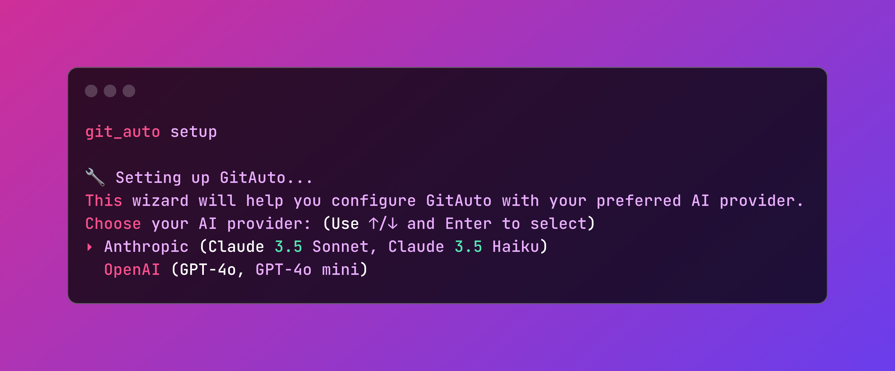
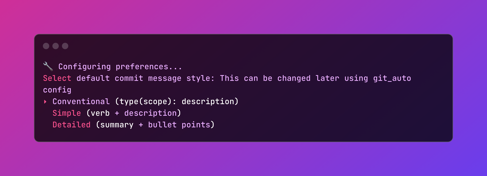
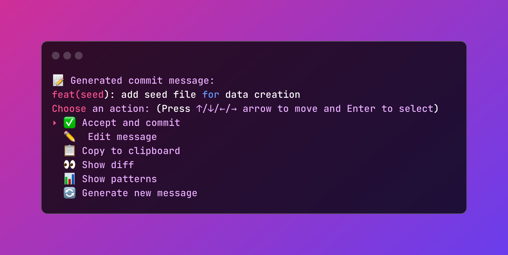

# GitAuto 🤖✨

[](https://rubygems.org/gems/git_auto)

> AI-powered commit messages that make sense

GitAuto is a Ruby gem that streamlines your git workflow by automatically generating meaningful commit messages using AI. Say goodbye to generic commit messages and hello to clear, consistent, and informative descriptions of your changes.

## Features 🚀

- 🎯 **Intelligent Analysis**: Automatically analyzes your staged changes
- 💡 **Smart Generation**: Creates conventional commit messages that actually make sense
- 🎨 **Beautiful CLI**: Interactive and colorful command-line interface
- 📋 **Clipboard Integration**: Easy copying of generated messages
- 🔍 **Diff Preview**: Optional preview of changes before message generation
- 📝 **Message History**: Keeps track of your commit messages
- 🤖 **AI Providers**: Supports multiple AI providers:
  - OpenAI (GPT-4o, GPT-4o mini)
  - Anthropic (Claude 3.5 Sonnet, Claude 3.5 Haiku)
  - Google (Gemini 2.5 Flash)
- 🔒 **Secure Storage**: Your API keys are encrypted using AES-256-CBC and stored securely

## Requirements ⚙️

- Ruby >= 3.0.0
- Git repository with staged changes
- 🎟️ One magical ingredient: an API key! Choose your AI companion:
  - 🔑 OpenAI API key ([Get one here](https://platform.openai.com/api-keys))
  - 🗝️ Anthropic API key ([Get one here](https://console.anthropic.com/))
  - 🌟 Google Gemini API key ([Get one here](https://makersuite.google.com/app/apikey))

That's it! Say goodbye to "misc fixes" and hello to commits that actually tell a story. Your future self will thank you! 🎩✨

## Installation 💎

Install the gem from [RubyGems](https://rubygems.org/gems/git_auto):

```bash
gem install git_auto
```

Or add to your Gemfile:

```ruby
gem 'git_auto'
```

## Setup and Configuration 🔧

### Initial Setup

Run the setup wizard to configure GitAuto:
```bash
git-auto setup
```
This will guide you through:
- Setting up your preferred AI provider
- Configuring your API keys (stored securely with AES-256-CBC encryption)
- Setting default preferences

### Configuration Management

Manage your settings anytime with:
```bash
git-auto config
```

This allows you to:
- Update API keys
- Change AI provider settings
- Modify default behaviors
- View current configuration

### Security 🔐

GitAuto takes security seriously:
- API keys are encrypted using AES-256-CBC encryption
- Keys are stored in your system's user directory (`~/.git_auto/credentials.yml`)
- You can set a custom encryption key via `GIT_AUTO_SECRET` environment variable

### Environment Variables

GitAuto can also be configured through environment variables:

- `OPENAI_API_KEY`: Your OpenAI API key for message generation
- `GIT_AUTO_MODEL`: OpenAI model to use (default: gpt-3.5-turbo)
- `GIT_AUTO_SECRET`: Custom encryption key for storing API keys (optional)

## Usage 🛠️

1. Stage your changes as usual:
```bash
git add .
```

2. Generate a commit message:
```bash
git-auto commit
```

3. Review, edit if needed, and confirm!

## Screenshots 📸





## Roadmap 🗺️

Here's what we're planning for future releases:

- 📝 Automatic PR description generation
- 🎯 Custom commit message templates
- 🔄 Integration with Git hooks
- More exciting features coming soon!

## Contributing 🤝

Bug reports and pull requests are welcome on GitHub at https://github.com/diazgdev/git_auto.

## License 📄

The gem is available as open source under the terms of the [MIT License](https://opensource.org/licenses/MIT).

---
Made with ❤️ by [Guillermo Diaz](https://github.com/diazgdev)
